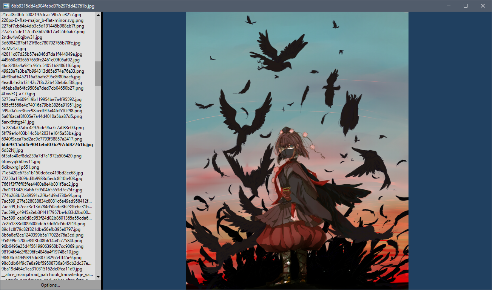

# Windows10PhotoViewerSucksAss
An alternative to the default windows 10 photo viewer.

This program exists because the standard Windows 10 photo viewer sucks so much ass. It is fucking slow and annoying.

## Controls:

| Button | Function |
|------|-----|
| LMB | Pan |
| LMB doubleclick | 1:1 |
| RMB | Zoom |
| T | Zoom to fit |
| S / D / Down / Right / MouseWheelDown | Next |
| A / W / Up / Left / MouseWheelUp | Previous |
| E | Open explorer at file |
| F | Full file path to clipboard |
| C | Copy file to clipboard |
| X | Cut file to clipboard |
| G | Fork program at current file |
| P | Open file properties |
| F5 | Refresh file list |
| F2 | Rename file |
| Del | Move to recycle bin |




## NatNumSort

The program now uses natural number sorting for the file list, similar to how Windows explorer sorts file names: ( a1.png, a2.png, a10.png ) instead of ( a1.png, a10,png, a2.png ).

It turned out that finding reasonable C# code that does this was tricky. Check out the NatnumSort class in this project, it doesn't allocate any heap memory, and it doesn't P/Invoke that one Windows function. As a bonus, it also preserves the (lexical) sorting order of hashes: (10a, 5ea) instead of (5ea, 10a). And it's just a static function.

## AppData

The application stores user preferences such as background color and window size in %LOCALAPPDATA%. The sub folder is equal to the name of the executable without its extension, so by default it is %LOCALAPPDATA%\Windows10PhotoViewerSucksAss.

## Origin

The program was hacked together in frustration and therefore the architecture is abysmal. But it's still better. Programming this was actually the very first thing I did after installing Windows 10 last year, and I've been using it since then.

## Bootstrap configuration

The application will attempt to read an xml file with the same name as the executable file, but with ".xml" attached. E.g. if the program's executable is "Windows10PhotoViewerSucksAss.exe", then it will look for "Windows10PhotoViewerSucksAss.exe.xml".

The file is optional looks like this:

```
<BootstrapData>
  <FriendlyApplicationName>Windows10PhotoViewerSucksDonkey</FriendlyApplicationName>
  <AppDataFolderName>Windows10PhotoViewerSucksDonkey</AppDataFolderName>
</BootstrapData>
```

| Property Name | Description |
|---------------|-------------|
| FriendlyApplicationName | Specifies how the program appears in the Open With menu and dialog. This is written to the application's Progid's open verb in the registry (if file associations are requested by the user). |
| AppDataFolderName | Specifies the subdirectory inside %LOCALAPPDATA% where the application will save user settings, such as window position and background color. |
